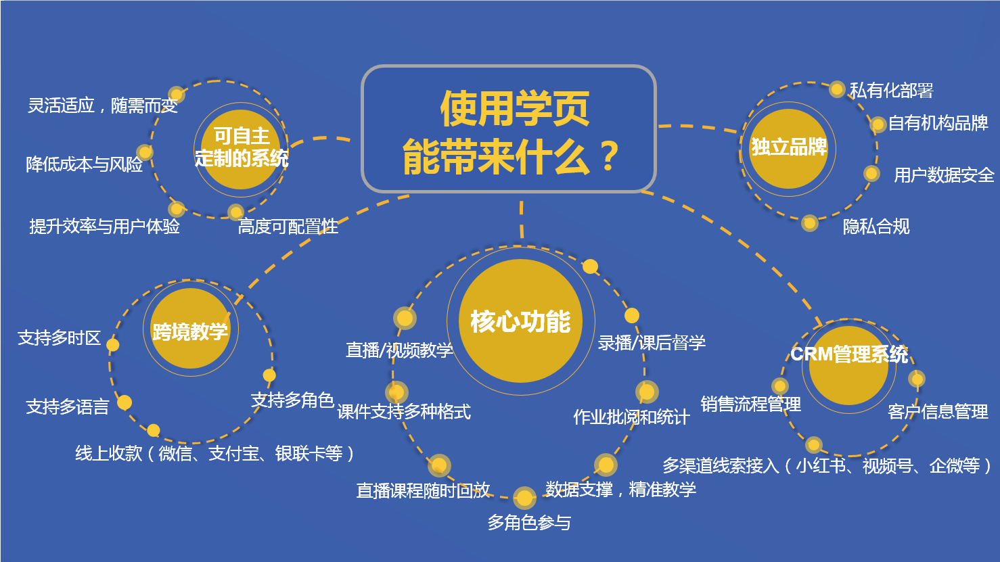
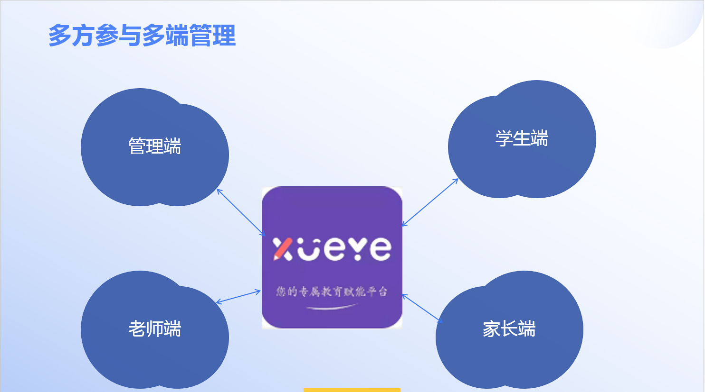
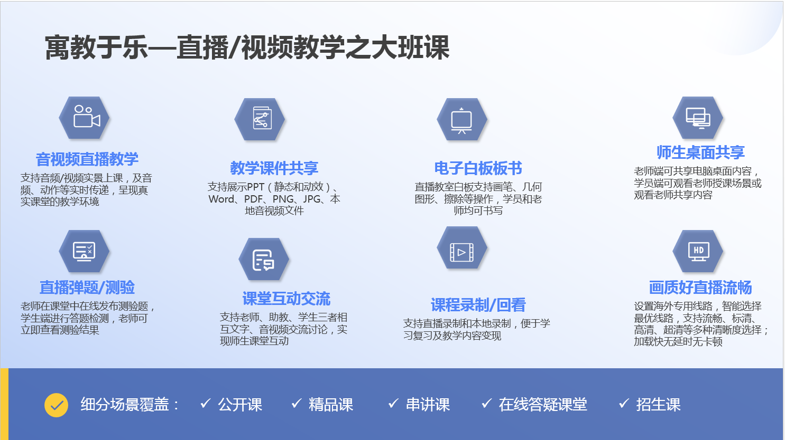
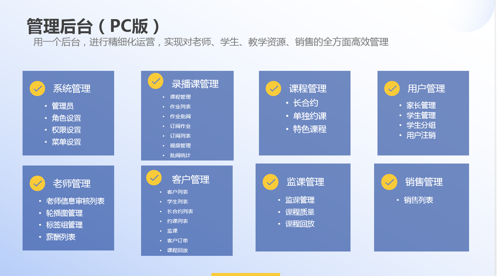
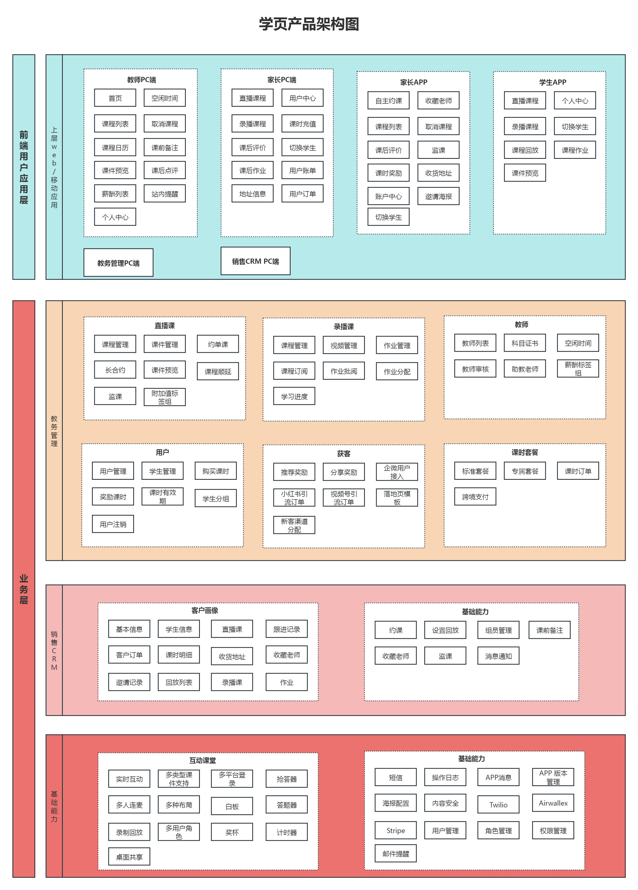

#### 使用须知
允许用于个人学习、毕业设计、教学案例、公益事业等。 
限制商用，若需要商业使用请咨询作者：17800297243（微信可加）。 
禁止将本项目的相关代码和相关资料进行任何形式任何名义的出售。 

#### 项目介绍
学页教育赋能平台 —— 一站式 在线教育系统解决方案，致力于帮助教育机构、教培创业者及企业快速搭建全场景、多终端、国际化的轻量级在线教育平台。系统采用前后端分离模式，前台采用vue.js为核心框架，后台采用Laravel为核心框架。系统分为教务端管理后台、销售CRM管理后台、教师PC端、教师客户端、家长PC端、家长APP、学生APP等。系统目前主要功能有直播课程、录播课程、课程附件管理，作业批阅、销售CRM管理等。支持大班课、小班课、1V1课程、多时区、多语言、跨境支付等功能，支持多渠道线索接入（小红书、视频号、企微等），可以帮助个人或者企业快速搭建一个轻量级的在线教育平台。

#### 核心功能
系统覆盖教务管理、销售转化、教学交付、家校互动四大核心场景，全面支持： 
✅ 多种授课模式：大班直播课、小班互动课、1V1私教课 
✅ 全球化能力：多时区适配、多语言切换、跨境支付（支持 Airwallex、Stripe等） 
✅ 全渠道招生：无缝对接小红书、视频号、企业微信等主流营销渠道 
✅ 精细化教务管理：课程排期、录播回放、课件/附件分发、作业布置与批阅、学习进度追踪 
✅ 一体化CRM系统：线索自动分配、客户跟进记录、续费提醒 

系统包含七大终端，满足全角色使用需求： 
教务管理后台（课程/教师/班级管理） 
销售 CRM 后台（线索→成交全流程） 
教师 PC 端 & 教师移动端（随时随地授课与管理） 
家长 PC 端 & 家长 APP（实时查看孩子学习情况） 
学生 APP（沉浸式学习体验） 

为什么选择学页？ 
🚀 快速上线：无需从零开发，3天部署专属在线学校 
💡 低成本启动：轻量级架构，适合个人讲师、中小型教培机构 
🌍 支持出海教育：内置多语言+跨境支付，助力教育出海 
🔍 精准获客转化：打通公域流量（小红书/视频号）到私域运营（企微/APP）闭环 

#### 产品架构图

#### 演示地址

管理系统：https://edu.xueye.yuejike.com/tenant/auth/login   
教师端：https://edu.xueye.yuejike.com/teacher  
家长端：https://edu.xueye.yuejike.com/parent  
前端技术体系：Vue3 + Nuxt3 + Vite6 + Vue-Router + Element-Plus + Pinia + Axios 
后端技术体系：Laravel + MySQL8 + Redis + Nginx + linux  

添加微信获取测试账号：17800297243（微信可加） 

